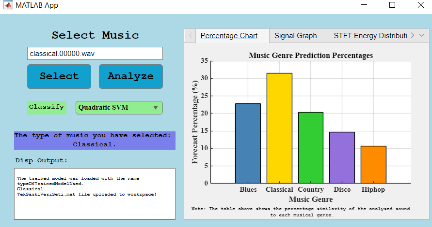
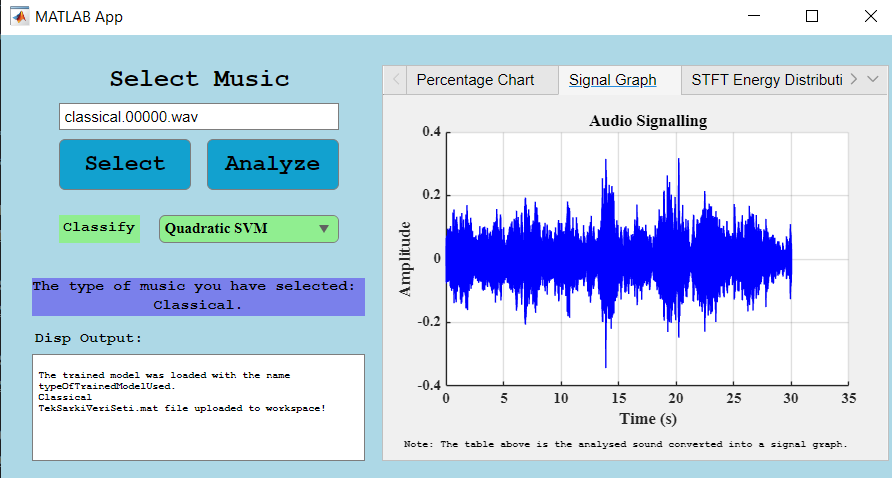
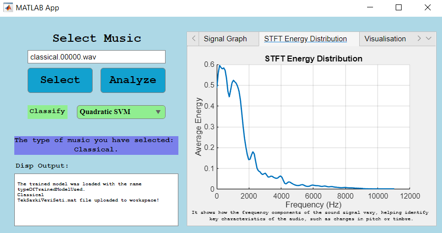
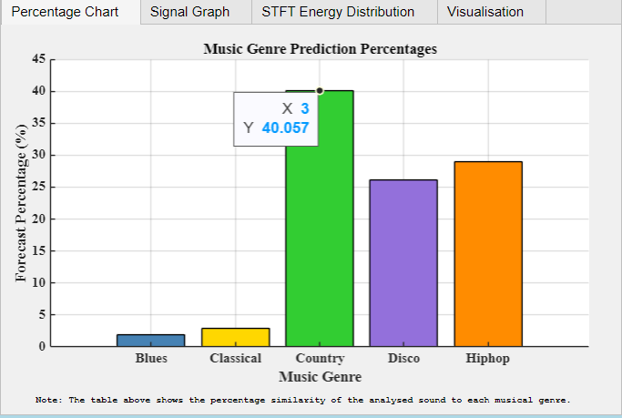
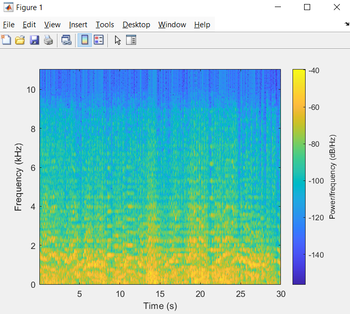

# **MATLAB Audio Analysis Application**

### **Overview**
This MATLAB application allows users to analyze audio files, predict the genre of the audio, and visualize key characteristics such as the spectrogram, STFT energy distribution, and signal waveform. 

The application supports different pre-trained models for classification and enables the extraction of audio features.

---

### **Features**
- **Audio File Selection**: Load `.wav` files for analysis.
- **Genre Classification**: Predict the genre of a song using machine learning models.
- **Visualization**:
  - Signal Graph
  - Spectrogram
  - STFT Energy Distribution
  - Percentage Predictions for Genres
- **Model Selection**: Choose from a variety of machine learning models:
  - Fine Tree
  - Medium Tree
  - Coarse Tree
  - Linear SVM
  - Fine KNN
  - Medium KNN
  - Coarse KNN
  - Boosted Trees
  - Narrow Neural Network
  - Medium Neural Network
  - Quadratic SVM

---

### **Prerequisites**
1. **MATLAB** (App Designer supported version)
2. Pre-trained models (`.mat` files):
   - `QuadraticSVM.mat`
   - `FineTree.mat`, `MediumTree.mat`, `CoarseTree.mat`
   - `LinearSVM.mat`
   - `FineKNN.mat`, `MediumKNN.mat`, `CoarseKNN.mat`
   - `BoostedTrees.mat`
   - `NarrowNeuralNetwork.mat`, `MediumNeuralNetwork.mat`
3. Audio files in **WAV** format.

---

### **Screenshots**
Here are some screenshots to illustrate the application's interface and features:

1. **Main Interface**  
   

2. **Signal Graph Visualization**  
   

3. **STFT Energy Distribution**  
   

4. **Genre Prediction Results**  
   

5. **Spektogram Graph**  
   
   

---

### **Installation**
1. Clone the repository:
   ```bash
   git clone https://github.com/insifa0/audio-analysis-matlab.git

2. Place all required .mat files (pre-trained models) in the project directory.
    - Download link (https://drive.google.com/drive/folders/1YcIw4szehDwtzp1m8zk9LaINDKLE_FAD?usp=sharing)
4. Open the project in MATLAB.
5. Run the app0.m file to launch the application.

---

### **Usage**

1. **Run the Application**:  
   Launch the app by running `MATLAB-Audio-Analysis-Application.mlapp`.

2. **Load an Audio File**:  
   - Click the **Select** button.  
   - Choose a `.wav` file from your local directory.

3. **Select a Model**:  
   - Use the dropdown menu to select the classification model.

4. **Analyze the Audio**:  
   - Click the **Analyze** button to extract features and predict the genre.

5. **View Results**:  
   - Visualize the signal, spectrogram, and STFT energy distribution in separate tabs.  
   - The predicted genre and classification scores are displayed.


